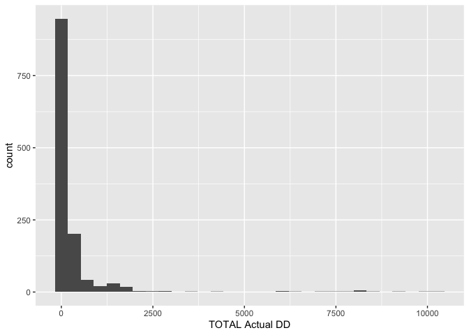
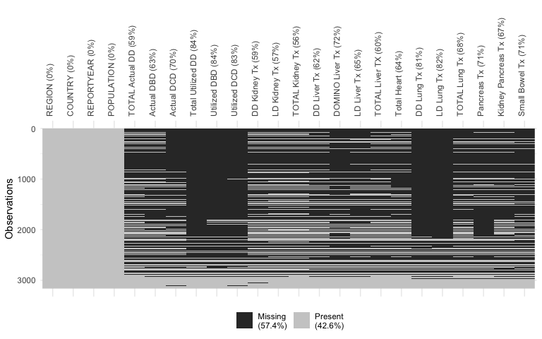
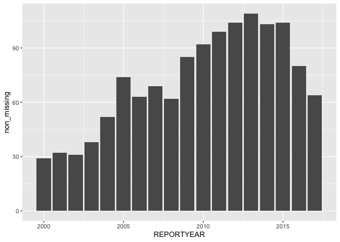
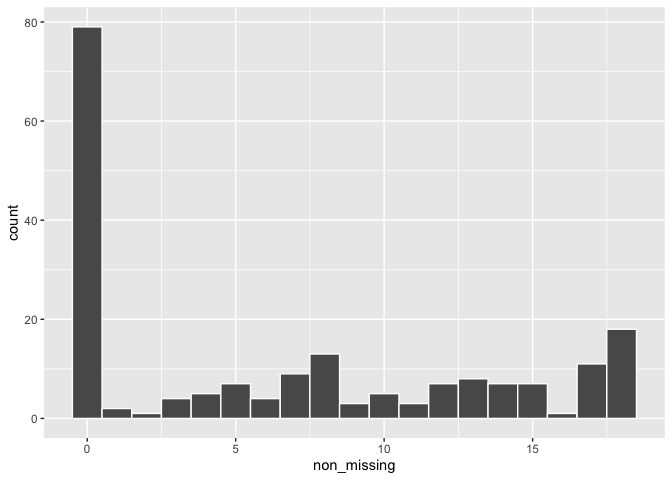
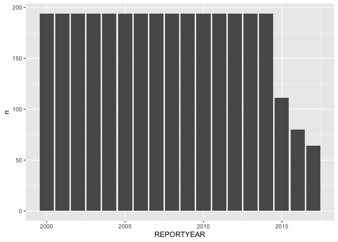
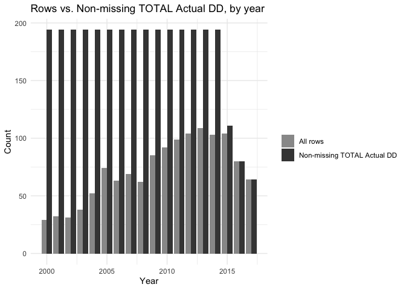

## Domain problem formulation

Our goal for this project is to understand global organ donation trends,
in particular, we want to identify countries that have demonstrated an
increase in organ transplant donation rates over time, and which
countries have the highest organ donation rates.

## Data source overview

In this file, we will examine and clean the organ donation data which
comes from the publicly available survey data from the Global
Observatory on Donation and Transplantation (GODT) that was collected in
a collaboration between World Health Organization (WHO) and the Spanish
Transplant Organization, Organización Nacional de Trasplantes (ONT). The
data portal can be found at
<http://www.transplant-observatory.org/export-database/>.

This database contains information about organ donations and transplants
(a total of 24 variables) for 194 countries and is collected every year
based on a survey that, according to the website, began in 2007. We will
consider a version of the data that contains information up to 2017
(downloaded in 2018) for this project.

First, let’s load the libraries that we will use in this document.

    # load the libraries we will need in this document
    library(tidyverse)
    library(naniar) # this is a nice package for visualizing missing data

The data is contained within the file
`data/global-organ-donation_2018.csv`. The questionnaire on which the
data is based is contained within the
`data/documentation/Questionnaire.pdf` PDF file. If you plan on working
with this data, we highly recommend that you glance through this
document.

## Step 1: Review background information

For additional background information on this project and dataset and
the project, see the relevant PCS documentation for this project.

-   *What does each variable measure?* A data dictionary is presented in
    the subsection below.

-   *How was the data collected?* The website
    (<http://www.transplant-observatory.org/methodology/>) from which we
    downloaded the organ donation data states that the data is based on
    a survey that began in 2007, and is sent annually via email to
    “national focal points”. For countries that have a centralized organ
    donation and transplantation organization, this information would
    likely be much easier to obtain than for the countries that do not
    have well-organized transplant systems (or which have multiple donor
    organizations). A copy of the survey itself is provided in the
    “data/documentation” folder[1]. Some questions that arise include:
    Who were these survey forms sent to (e.g., who is the contact
    point)? Which countries each country have a centralized organ
    donation organization? Some reading online revealed a very wide
    range of organ donation practices worldwide.

-   *What are the observational units?* To identify the observational
    units, consider for what entities each full set of organ donation
    measurements is collected. For the organ donation data, these are
    the year and country combinations (a complete set of measurements
    are taken for each country, every year), which we will call the
    “country-years”.

-   *Is the data relevant to my project?* Since this data is likely the
    most comprehensive public global summary of organ donations
    available, and since it covers a reasonably broad time period, this
    data is certainly relevant to the project.

-   *What questions do I have and what assumptions am I making?* One
    immediate *assumption* that we made when looking at the data was
    that there exists a hierarchy for some of the variables. For
    instance, the total number of deceased donors (`TOTAL Actual DD`)
    appears to be broken down into brain-death deceased donors
    (`Actual DBD`) and circulatory-death deceased donors (`Actual DCD`),
    implying that these two sub-counts *should* add up to the total
    count. After we loaded the data into R (in the next step), we
    conducted some quick checks in the data to confirm that this is true
    in all but a small number of rare cases.

### Data dictionary

The data dictionary we found on the website at the time of data
collection is printed below:

    REGION: the global region in which the country lies
    COUNTRY: the name of the country for which the data is collected
    REPORTYEAR: the year for which the data is collected
    POPULATION: the population of the country for the given year
    TOTAL Actual DD: total number of deceased organ donors
    Actual DBD: number of deceased organ donors after brain death
    Actual DCD: number of deceased organ donors after circulatory death
    Total Utilized DD: total number of utilized deceased organ donors
    Utilized DBD: number of utilized deceased organ donors after brain death
    Utilized DCD: number of utilized deceased organ donors after circulatory death
    DD Kidney Tx: number of kidneys from deceased donors
    LD Kidney Tx: number of kidneys from living donors
    TOTAL Kidney Tx: total number of kidneys from all donors
    DD Liver Tx: number of livers from deceased donors
    DOMINO Liver Tx: number of domino livers
    LD Liver Tx: number of livers from living donors
    TOTAL Liver Tx: total number of livers from all donors
    TOTAL Heart: total number of hearts from all donors
    DD Lung Tx: number of lungs from deceased donors
    LD Lung Tx: number of lungs from living donors
    TOTAL Lung Tx: total number of lungs from all donors
    Pancreas Tx: total number of pancreases from all donors
    Kidney Pancreas Tx: total number of kidney-pancreases from all donors
    Small Bowel Tx: total number of small bowels from all donors

Some questions that immediately arise include what does it mean for an
organ donor to be *“utilized”*? Does this imply that not all donated
organs are used? After much scouring GODT resources, we eventually found
this definition in the following pdf
(<https://tts.org/images/GODT/2020-Global-report-para-web-1.pdf>):

-   “Actual deceased donor”: Deceased person from whom at least one
    organ has been recovered for the purpose of transplantation.

-   “Utilized deceased donor”: An actual donor from whom at least one
    organ has been transplanted.

That is, an organ from an “actual deceased donor” has been recovered for
the purpose of transplantation, but may not actually end up being
transplanted (presumably due to logistical issues, such as not finding a
suitable recipient, spoilage, etc).

Our gut feeling is that we should use the `TOTAL Actual DD` variable,
rather than the `Total Utilized DD` variable, but it will be helpful to
identify how similar/different these two variables are:

**Question: What proportion of deceased donors are “utilized” deceased
donors?**

Do most organs recovered for transplantation actually get transplanted?

We will answer this question in our explorations below.

Feel free to document here any additional questions or assumptions that
you made while looking at the website or the data dictionary above.

## Step 2: Loading in the data

Let’s load in the data. Note that we had some issues using `read_csv()`
without specifying the column types (`read_csv()` would assume incorrect
types for columns with a lot of leading missing values, and then would
mess up the formatting of the remaining non-missing values in these
columns because they did not fit the presumed type). For this reason, we
provided a `col_types` argument to `read_csv()`.

    organs_original <- read_csv("/Users/dzheng46/Documents/MATH_534_Materials/global-organ-donation_2018.csv", 
                                col_types = list(`Utilized DBD` = col_number(),
                                                 `DD Lung Tx` = col_number(),
                                                 `Total Utilized DD` = col_number(),
                                                 `LD Lung Tx` = col_number())) 

Below, we print the data column names and notice that they match the
names presented in the data dictionary.

    colnames(organs_original)

    ##  [1] "REGION"             "COUNTRY"            "REPORTYEAR"        
    ##  [4] "POPULATION"         "TOTAL Actual DD"    "Actual DBD"        
    ##  [7] "Actual DCD"         "Total Utilized DD"  "Utilized DBD"      
    ## [10] "Utilized DCD"       "DD Kidney Tx"       "LD Kidney Tx"      
    ## [13] "TOTAL Kidney Tx"    "DD Liver Tx"        "DOMINO Liver Tx"   
    ## [16] "LD Liver Tx"        "TOTAL Liver TX"     "Total Heart"       
    ## [19] "DD Lung Tx"         "LD Lung Tx"         "TOTAL Lung Tx"     
    ## [22] "Pancreas Tx"        "Kidney Pancreas Tx" "Small Bowel Tx"

Below, we have printed the first 20 rows of the dataset. Note that *all
of the values after the first 4 identifier columns are missing for these
first 20 rows*. We checked the data manually to make sure that this was
not a data loading error, and it does seem that the data has been loaded
in correctly.

    head(organs_original, n = 20)

    ## # A tibble: 20 × 24
    ##    REGION           COUNTRY REPORTYEAR POPULATION `TOTAL Actual DD` `Actual DBD`
    ##    <chr>            <chr>        <dbl>      <dbl>             <dbl>        <dbl>
    ##  1 Europe           Andorra       2000        0.1                NA           NA
    ##  2 Eastern Mediter… United…       2000        2.4                NA           NA
    ##  3 Eastern Mediter… Afghan…       2000       22.7                NA           NA
    ##  4 America          Antigu…       2000        0.1                NA           NA
    ##  5 Europe           Albania       2000        3.1                NA           NA
    ##  6 Europe           Armenia       2000        3.5                NA           NA
    ##  7 Africa           Angola        2000       12.9                NA           NA
    ##  8 America          Argent…       2000       37                  NA           NA
    ##  9 Europe           Austria       2000        8.2               194          194
    ## 10 Western Pacific  Austra…       2000       18.9               195          195
    ## 11 Europe           Azerba…       2000        7.7                NA           NA
    ## 12 Europe           Bosnia…       2000        4                  NA           NA
    ## 13 America          Barbad…       2000        0.3                NA           NA
    ## 14 South-East Asia  Bangla…       2000      129.                 NA           NA
    ## 15 Europe           Belgium       2000       10.2               256          256
    ## 16 Africa           Burkin…       2000       11.9                NA           NA
    ## 17 Europe           Bulgar…       2000        8.2                26           26
    ## 18 Eastern Mediter… Bahrain       2000        0.6                NA           NA
    ## 19 Africa           Burundi       2000        6.7                NA           NA
    ## 20 Africa           Benin         2000        6.1                NA           NA
    ## # ℹ 18 more variables: `Actual DCD` <dbl>, `Total Utilized DD` <dbl>,
    ## #   `Utilized DBD` <dbl>, `Utilized DCD` <dbl>, `DD Kidney Tx` <dbl>,
    ## #   `LD Kidney Tx` <dbl>, `TOTAL Kidney Tx` <dbl>, `DD Liver Tx` <dbl>,
    ## #   `DOMINO Liver Tx` <dbl>, `LD Liver Tx` <dbl>, `TOTAL Liver TX` <dbl>,
    ## #   `Total Heart` <dbl>, `DD Lung Tx` <dbl>, `LD Lung Tx` <dbl>,
    ## #   `TOTAL Lung Tx` <dbl>, `Pancreas Tx` <dbl>, `Kidney Pancreas Tx` <dbl>,
    ## #   `Small Bowel Tx` <dbl>

We also print a *random* sample of 20 rows from the data below.

    set.seed(45219)
    organs_original |>
      sample_n(size = 20) 

    ## # A tibble: 20 × 24
    ##    REGION           COUNTRY REPORTYEAR POPULATION `TOTAL Actual DD` `Actual DBD`
    ##    <chr>            <chr>        <dbl>      <dbl>             <dbl>        <dbl>
    ##  1 Europe           Sweden        2003        8.9               114          114
    ##  2 Europe           Belgium       2006       10.4               282          249
    ##  3 Western Pacific  Mongol…       2010        2.7                 1            1
    ##  4 Europe           Italy         2015       59.8              1369         1361
    ##  5 Eastern Mediter… Djibou…       2011        0.9                NA           NA
    ##  6 Europe           Kazakh…       2010       15.8                NA           NA
    ##  7 Europe           Ireland       2013        4.6                86           80
    ##  8 Africa           South …       2013       52.8                70           65
    ##  9 Europe           Russia…       2006      142.                 NA           NA
    ## 10 Europe           Bosnia…       2007        3.9                NA           NA
    ## 11 Western Pacific  Mongol…       2005        2.6                 0            0
    ## 12 America          Peru          2004       27.6                29           29
    ## 13 Europe           Monten…       2010        0.6                NA           NA
    ## 14 Europe           Austria       2014        8.5               212          206
    ## 15 America          Guyana        2002        0.8                NA           NA
    ## 16 Africa           South …       2007       47.7                62           NA
    ## 17 America          Colomb…       2004       44.9               258          258
    ## 18 Europe           Nether…       2015       16.9               284          128
    ## 19 Western Pacific  Malays…       2007       26.2                25           15
    ## 20 America          Saint …       2008        0.1                NA           NA
    ## # ℹ 18 more variables: `Actual DCD` <dbl>, `Total Utilized DD` <dbl>,
    ## #   `Utilized DBD` <dbl>, `Utilized DCD` <dbl>, `DD Kidney Tx` <dbl>,
    ## #   `LD Kidney Tx` <dbl>, `TOTAL Kidney Tx` <dbl>, `DD Liver Tx` <dbl>,
    ## #   `DOMINO Liver Tx` <dbl>, `LD Liver Tx` <dbl>, `TOTAL Liver TX` <dbl>,
    ## #   `Total Heart` <dbl>, `DD Lung Tx` <dbl>, `LD Lung Tx` <dbl>,
    ## #   `TOTAL Lung Tx` <dbl>, `Pancreas Tx` <dbl>, `Kidney Pancreas Tx` <dbl>,
    ## #   `Small Bowel Tx` <dbl>

Next, we check the dimension of the data.

    dim(organs_original)

    ## [1] 3165   24

The above code shows that there are 3,165 rows. As a sanity check, this
number should probably be divisible by the number of countries in the
data. The number of countries in the data is:

    organs_original |> 
      summarise(n_distinct(COUNTRY))

    ## # A tibble: 1 × 1
    ##   `n_distinct(COUNTRY)`
    ##                   <int>
    ## 1                   194

But 3,165 is *not* divisible by 194:

    3165 / 194

    ## [1] 16.31443

Moreover, if the survey started in 2007 and we have data up to the year
2017 (11 years total), then we should have 11 × 194 = 2, 134 rows in the
data. Clearly, *something* is wrong. At this stage, we don’t know what
is wrong but will make a note to ensure that we figure out what is going
on. If by the end of the evaluations that we will conduct below, we
haven’t figured it out, then we will do some specific explorations to
try and understand why.

**Question: Why does the number of rows in the data not match what we
expect?**

The number of rows in the data are not divisible by the number of
countries, which is a bit strange, since we would have assumed that each
country would have contributed the same number of rows to the data.

To determine the ways in which the data needs to be cleaned, we will
follow the suggestions provided in Chapter 5 of Veridical Data Science.

## Step 3: Examine the data and create action items

In this section, we will look at the data itself to try to identify any
invalid values, understand the missing values, and any abnormalities in
the data, following the workflow outlined in Chapter 5.

### Finding invalid values

Below, we print out the smallest (minimum) and largest (maximum), and
average values of each numeric column.

    organs_original |> 
      # keep only numeric variables
      select(where(is.numeric)) |> 
      # for each column, compute a data frame with the min, mean, and max.
      map_df(function(.col) { data.frame(min = min(.col, na.rm = TRUE),
                                         mean = mean(.col, na.rm = TRUE),
                                         max = max(.col, na.rm = TRUE)) },
             .id = "variable")

    ##              variable  min         mean     max
    ## 1          REPORTYEAR 2000 2007.7102686  2017.0
    ## 2          POPULATION    0   35.2372828  1393.8
    ## 3     TOTAL Actual DD    0  310.7263566 10286.0
    ## 4          Actual DBD    0  289.4758679  8403.0
    ## 5          Actual DCD    0   38.8727842  3298.0
    ## 6   Total Utilized DD    0  285.6991870  9706.0
    ## 7        Utilized DBD    0  248.2276265  8075.0
    ## 8        Utilized DCD    0   39.6361905  3243.0
    ## 9        DD Kidney Tx    0  487.1070336 14827.0
    ## 10       LD Kidney Tx    0  303.1408759  6647.0
    ## 11    TOTAL Kidney Tx    0  752.2312634 20638.0
    ## 12        DD Liver Tx    0  243.1364010  7715.0
    ## 13    DOMINO Liver Tx    0    1.4474576    71.0
    ## 14        LD Liver Tx    0   45.6954545  1200.0
    ## 15     TOTAL Liver TX    0  277.0598563  8082.0
    ## 16        Total Heart    0   78.0517998  3273.0
    ## 17         DD Lung Tx    0   56.1216216  2478.0
    ## 18         LD Lung Tx    0    0.2030981    20.0
    ## 19      TOTAL Lung Tx    0   59.7207473  2478.0
    ## 20        Pancreas Tx    0   41.0184582  1484.0
    ## 21 Kidney Pancreas Tx    0   29.8423552   924.0
    ## 22     Small Bowel Tx    0    3.7208791   198.0

Note: this `map_df()` function above is looping through each column of
the data frame and for each column, it returns a 1-row data frame with a
min, mean, and max column. The output is these 1-row data frames stacked
together into a single data frame, and adds an ID column called
“variable” (by specifying the argument `.id = "variable"` does).

There don’t appear to be any negative count values, but the population
seems to be on a strange scale (why are there countries whose population
is 0, why is the largest population just 1393.8, and how can you have .8
of a person?).

The table below shows the average recorded population for a sample of 20
countries.

    set.seed(45219)
    organs_original |>
      # for each country
      group_by(COUNTRY) |>
      # compute the average population
      summarise(POPULATION = mean(POPULATION)) |>
      ungroup() |>
      sample_n(20) |>
      # arrange the rows alphabetically
      arrange(COUNTRY)

    ## # A tibble: 20 × 2
    ##    COUNTRY                               POPULATION
    ##    <chr>                                      <dbl>
    ##  1 Albania                                   3.16  
    ##  2 Australia                                21.5   
    ##  3 Bangladesh                              150.    
    ##  4 Belize                                    0.273 
    ##  5 Central African Republic                  4.2   
    ##  6 Costa Rica                                4.53  
    ##  7 Democratic People's Republic of Korea    23.5   
    ##  8 Gabon                                     1.44  
    ##  9 Kiribati                                  0.0933
    ## 10 Paraguay                                  6.32  
    ## 11 Republic of Moldova                       3.97  
    ## 12 Saint Lucia                               0.2   
    ## 13 Saint Vincent and the Grenadines          0.1   
    ## 14 Sierra Leone                              5.54  
    ## 15 Singapore                                 4.72  
    ## 16 South Africa                             48.7   
    ## 17 Suriname                                  0.447 
    ## 18 Tajikistan                                6.93  
    ## 19 United States of America                307.    
    ## 20 Vanuatu                                   0.22

Since we know the population of Australia should be more like 21.5
million, rather than 21.5, this implies that the populations are on a
scale of millions. We manually checked that this is also true for a few
other countries.

So that the population variable is as transparent as possible, we will
note a cleaning action item to be included in our final cleaning
function.

**Data cleaning action item: Multiply the population variable by 1
million**

Multiply the population variable by 1 million. We won’t worry about the
rounding error, but note that these population values are far from
exact.

Taking another look at the first 20 rows printed in the table above (in
the data loading section), we also notice that the year pre-dates 2007,
which was when the survey supposedly began.

**Question: Why does the data contain years pre-2007**

The data contains information prior to 2007, which was when the data
collection survey supposedly began. Why is this the case? We couldn’t
find information online to answer this question, but perhaps this is due
to back-reporting (i.e. countries providing historical data), or perhaps
it is a mistake in the documentation.

**Data cleaning action item: Add an option to remove the pre-2007 data**

We want to have an option in our cleaning function to remove the
pre-2007 data, but the default option will be to keep it.

To investigate if there are any strange values in the `TOTAL Actual DD`
variable, the figure below displays a histogram of the `TOTAL Actual DD`
variable.

    organs_original |>
      ggplot() +
      geom_histogram(aes(x = `TOTAL Actual DD`))

    ## `stat_bin()` using `bins = 30`. Pick better value with `binwidth`.

    ## Warning: Removed 1875 rows containing non-finite outside the scale range
    ## (`stat_bin()`).

The distribution is heavily skewed with a lot of 0s, but nothing looks
particularly unusual.

Before moving on, let’s conduct some sanity checks by ensuring that the
number of total donors does not exceed the population and is not
exceeded by any of the sub-counts. The code below counts the number of
times (rows in which) the total donor count exceeds the population and
the number of times the total donor count is exceeded by the relevant
sub-count. We would expect each of these sums to be equal to 0.

    organs_original |>
      summarise(donor_vs_pop = sum(`TOTAL Actual DD` > POPULATION * 1000000,
                                   na.rm = TRUE),
                donor_vs_dcd = sum(`TOTAL Actual DD` < `Actual DCD`,
                                   na.rm = TRUE),
                donor_vs_dbd = sum(`TOTAL Actual DD` < `Actual DBD`,
                                   na.rm = TRUE),
                donor_vs_utilized = sum(`TOTAL Actual DD` < `Total Utilized DD`,
                                        na.rm = TRUE),
                donor_vs_kidney = sum(`TOTAL Actual DD` < `TOTAL Kidney Tx`,
                                      na.rm = TRUE),
                donor_vs_liver = sum(`TOTAL Actual DD` < `TOTAL Liver TX`,
                                      na.rm = TRUE),
                donor_vs_heart = sum(`TOTAL Actual DD` < `Total Heart`,
                                      na.rm = TRUE))

    ## # A tibble: 1 × 7
    ##   donor_vs_pop donor_vs_dcd donor_vs_dbd donor_vs_utilized donor_vs_kidney
    ##          <int>        <int>        <int>             <int>           <int>
    ## 1            0            0            0                 0            1201
    ## # ℹ 2 more variables: donor_vs_liver <int>, donor_vs_heart <int>

Interestingly, the number of kidney and liver transplant counts seem to
often exceed the total number of donors. But using our domain knowledge,
this is not actually surprising once we realize that a single donor can
provide *two* kidneys for transplant, and a single donated liver can be
split between two recipients.

Overall, the only unusual or inconsistent values that we found come from
the population variable and the pre-2007 values.

### \[problem-specific\] Checking COUNTRY and YEAR combinations are unique

It occurs to us to check that each country-year combination is unique
(i.e., there are no duplicated entries in the data). The table below
counts the number of times each country-year combination appears in the
data and shows the distinct counts. Since the only entry is 1, this
implies that each country-year combination only appears once in the
data, which is good.

    organs_original |>
      # count the number of unique country-reportyear combinations
      count(COUNTRY, REPORTYEAR) |>
      # show just the distinct counts
      distinct(n)

    ## # A tibble: 1 × 1
    ##       n
    ##   <int>
    ## 1     1

### Examining missing values

From our tables and histograms above, it doesn’t look like there are any
extreme values (such as `999`) that are hiding missing values. To make
sure, we will plot a histogram of a few of the variables.

@tbl-missing-cols shows the number and proportion of missing rows in
each column, arranged in order of least to most missingness.

    organs_original |> 
      # for each column, count the number of entries that are equal to NA
      summarise(across(everything(), ~sum(is.na(.)))) |>
      # convert the result to a "long-form" data frame
      pivot_longer(everything(), names_to = "variable", values_to = "missing_rows") |>
      # add a column corresponding to the *proportion* of missing values
      mutate(prop_missing = missing_rows / nrow(organs_original)) |>
      # arrange the rows in increasing order of missingness
      arrange(missing_rows)

    ## # A tibble: 24 × 3
    ##    variable        missing_rows prop_missing
    ##    <chr>                  <int>        <dbl>
    ##  1 REGION                     0        0    
    ##  2 COUNTRY                    0        0    
    ##  3 REPORTYEAR                 0        0    
    ##  4 POPULATION                 0        0    
    ##  5 TOTAL Kidney Tx         1764        0.557
    ##  6 LD Kidney Tx            1795        0.567
    ##  7 DD Kidney Tx            1857        0.587
    ##  8 TOTAL Actual DD         1875        0.592
    ##  9 TOTAL Liver TX          1912        0.604
    ## 10 DD Liver Tx             1948        0.615
    ## # ℹ 14 more rows

Other than the descriptor and ID variables of `REGION`, `COUNTRY`,
`REPORTYEAR`, and `POPULATION`, there are a LOT of missing values in
this dataset. Almost 60% of the `TOTAL Actual DD` values (our variable
of interest) are missing!

@fig-missing shows the distribution of missing data across the entire
dataset (using the `vis_miss()` function from the `naniar` R package).

    vis_miss(organs_original) +
      # rotate the variable names 90 degrees
      theme(axis.text.x = element_text(angle = 90))

<figure>

<figcaption aria-hidden="true">A heatmap showing the distribution of
missing data in the original organ donations dataset</figcaption>
</figure>

How this missingness is distributed over time? @fig-missing-proportions
shows the number of *non-missing* values reported for each year.
Clearly, the earlier years (especially pre-2007!) have more missing
values than the later years, but the missingness starts to increase
again after 2014, which seems odd.

    organs_original |>
      # for each reportyear
      group_by(REPORTYEAR) |>
      # count the number of times the TOTAL Actual DD variable is *not* missing
      summarise(non_missing = sum(!is.na(`TOTAL Actual DD`))) |>
      # plot the number of non-missing values each year using a bar plot
      ggplot() +
      geom_col(aes(x = REPORTYEAR, y = non_missing))

<figure>

<figcaption aria-hidden="true">The number of non-missing TOTAL Actual DD
values by year. There are a total of 194 countries, so if there was no
missing data, each bar would reach a height of 194.</figcaption>
</figure>

What about the distribution of missingness by country? Is it the case
that there are countries for which individual years of data are missing?
Or is it instead that all of the data are missing or none of it is?

@tbl-country-non-missing shows the number of non-missing
`TOTAL Actual DD` entries for a random sample of 20 countries. There
seems to be a really big range of missingness patterns across the
countries! Some countries report literally no data, whereas others
report data for 5, 10, or 13 years.

    set.seed(45219)
    organs_original |>
      # for each country
      group_by(COUNTRY) |>
      # count the number of times the TOTAL Actual DD variable is *not* missing
      summarise(non_missing = sum(!is.na(`TOTAL Actual DD`))) |> 
      # take a random sample of 20 countries
      sample_n(20) |>
      # arrange in alphabetical order
      arrange(COUNTRY)

    ## # A tibble: 20 × 2
    ##    COUNTRY                               non_missing
    ##    <chr>                                       <int>
    ##  1 Albania                                         5
    ##  2 Australia                                      17
    ##  3 Bangladesh                                      0
    ##  4 Belize                                          0
    ##  5 Central African Republic                        0
    ##  6 Costa Rica                                     10
    ##  7 Democratic People's Republic of Korea           0
    ##  8 Gabon                                           0
    ##  9 Kiribati                                        0
    ## 10 Paraguay                                       13
    ## 11 Republic of Moldova                             9
    ## 12 Saint Lucia                                     0
    ## 13 Saint Vincent and the Grenadines                0
    ## 14 Sierra Leone                                    0
    ## 15 Singapore                                      12
    ## 16 South Africa                                   12
    ## 17 Suriname                                        0
    ## 18 Tajikistan                                      6
    ## 19 United States of America                       18
    ## 20 Vanuatu                                         0

Let’s visualize the distribution of non-missing data by country in
@fig-country-non-missing.

    organs_original |>
      # for each country
      group_by(COUNTRY) |>
      # count the number of times the TOTAL Actual DD variable is *not* missing
      summarise(non_missing = sum(!is.na(`TOTAL Actual DD`))) |>
      # plot the distribution of the country missing value counts
      ggplot() +
      geom_histogram(aes(x = non_missing), 
                     binwidth = 1, color = "white")

<figure>

<figcaption aria-hidden="true">The distribution of the number of
non-missing TOTAL Actual DD values reported for each
country</figcaption>
</figure>

It seems that almost 80 countries report absolutely no data (the first,
left-most bar), while fewer than 20 countries report data every year
(the final, right-most bar). That’s quite disappointing…

Out of curiosity, let’s explicitly look at the data for some of the
countries that report data every year, and some of the countries who
report data for just *some* of the years.

@tbl-austria shows the `TOTAL Actual DD` counts for Austria, which had
non-missing values for every year.

    organs_original |> 
      filter(COUNTRY == "Austria") |> 
      select(COUNTRY, REPORTYEAR, `TOTAL Actual DD`)

    ## # A tibble: 18 × 3
    ##    COUNTRY REPORTYEAR `TOTAL Actual DD`
    ##    <chr>        <dbl>             <dbl>
    ##  1 Austria       2000               194
    ##  2 Austria       2001               191
    ##  3 Austria       2002               195
    ##  4 Austria       2003               189
    ##  5 Austria       2004               185
    ##  6 Austria       2005               203
    ##  7 Austria       2006               207
    ##  8 Austria       2007               185
    ##  9 Austria       2008               172
    ## 10 Austria       2009               214
    ## 11 Austria       2010               196
    ## 12 Austria       2011               205
    ## 13 Austria       2012               198
    ## 14 Austria       2013               208
    ## 15 Austria       2014               212
    ## 16 Austria       2015               205
    ## 17 Austria       2016               217
    ## 18 Austria       2017               213

@tbl-peru, however, shows the results for Peru, which has data for 10 of
the 18 years

    organs_original |> 
      filter(COUNTRY == "Peru") |> 
      select(COUNTRY, REPORTYEAR, `TOTAL Actual DD`)

    ## # A tibble: 18 × 3
    ##    COUNTRY REPORTYEAR `TOTAL Actual DD`
    ##    <chr>        <dbl>             <dbl>
    ##  1 Peru          2000                NA
    ##  2 Peru          2001                NA
    ##  3 Peru          2002                NA
    ##  4 Peru          2003                NA
    ##  5 Peru          2004                29
    ##  6 Peru          2005                22
    ##  7 Peru          2006                NA
    ##  8 Peru          2007                NA
    ##  9 Peru          2008                NA
    ## 10 Peru          2009                NA
    ## 11 Peru          2010                94
    ## 12 Peru          2011               127
    ## 13 Peru          2012                94
    ## 14 Peru          2013                97
    ## 15 Peru          2014                73
    ## 16 Peru          2015                82
    ## 17 Peru          2016                70
    ## 18 Peru          2017                52

The type of missingness is interesting and definitely tells us something
about how we might want to impute these values since it is unlikely that
those middle missing values should be zero (i.e., it is unlikely that
`NA` here represents a lack of any donations).

Depending on the analysis that we want to conduct, it will likely be
helpful to impute the missing values (e.g., if we are trying to compute
total donor counts over time to reduce the extent of under-counting).
For some visualizations though, we won’t need imputed values, so
imputation will be an optional pre-processing action item.

Some reasonable action items for dealing with the missingness might be
to replace each missing count for each country with:

-   The *average* of the two surrounding non-missing values from the
    country.

-   The *closest* (in terms of year) non-missing value from the country.
    If the missing value is equidistant between two non-missing years,
    we could choose one at random.

-   The *previous* non-missing value from the country.

-   An *interpolated* value that takes into account the trend from all
    of the non-missing values from the country.

For the countries that do not report *any* donor counts (i.e., all their
data is missing), we will impute their donor counts with 0. Here we are
making an *assumption* that the countries that have entirely missing
data do not have an organ donation system in place. This is probably not
an entirely realistic assumption, however since there may be some
countries that do have an organ donor system but chose not to report any
data to the GODT, but since this data does not exist in the public
domain, there is nothing else that we can really do about it.

**Pre-processing action item: Impute the donor count variable**

There are several judgment call options that seem reasonable for
creating imputed donor count variables, including:

-   The *average* of the two surrounding non-missing values from the
    country.

-   The *previous* non-missing value from the country.

For the countries that do not report *any* donor counts (i.e., all their
data is missing), we will impute their donor counts with 0.

Other options include imputing using the *closest* (in terms of year)
non-missing value from the country and using an *interpolated* value
that takes into account the trend from all of the non-missing values
from the country, but these are much trickier to code so we exclude them
here.

#### Imputation function

Below, we define a function, `imputeFeature()`, that we will later call
inside our data cleaning/pre-processing function to impute the missing
values, with arguments for each imputation judgment call option.

Note that some of this code is quite advanced (it uses map functions and
list columns, and we haven’t introduced linear predictive model, `lm()`,
yet for the “interpolated” imputation approach), but we show it here as
an example of a sophisticated function with many options. You aren’t
expected to write something like this yourself at this stage.

    # function for conducting the imputation of a specified feature
    imputeFeature <- function(.data,
                              .feature,
                              .group,
                              .impute_method = c("average", "previous")) {
      # identify which imputation method is being used
      .impute_method <- match.arg(.impute_method)
      
      if (.impute_method == "previous") {
        .data <- .data |>
          # duplicate the relevant column and call it "feature_imputed"
          # this {{ }} notation is "tidy eval" - it allows us to pass unquoted 
          # variable names
          mutate(feature_imputed = {{ .feature }}) |>
          # for each .group (country)
          group_by({{ .group }}) |>
          # use the fill function from the tidyr package (part of the tidyverse)
          # to impute the relevant feature
          fill(feature_imputed, .direction = "down") |>
          ungroup() |>
          # for entries whose values are still missing (e.g., countries with no 
          # data reported), fill the missing value with 0
          mutate(feature_imputed = if_else(is.na(feature_imputed), 0, feature_imputed))
      } else if (.impute_method == "average") {
        .data <- .data |>
          # duplicate the relevant column two times and call these duplicates
          # "feature_imputed_tmp_prev" and "feature_imputed_tmp_next"
          # we will fill the missing values in these columns with the previous and 
          # next non-missing values respectively
          # this {{ }} notation is "tidy eval" - it allows us to pass unquoted 
          # variable names
          mutate(imputed_feature_tmp_prev = {{ .feature }},
                 imputed_feature_tmp_next = {{ .feature }}) |>
          # for each .group (country)
          group_by({{ .group }}) |>
          # use the fill function to impute the missing values with previous 
          # non-missing value 
          fill(imputed_feature_tmp_prev, .direction = "down") |>
          # use the fill function to impute the missing values with next 
          # non-missing value
          fill(imputed_feature_tmp_next, .direction = "up") |>
          ungroup() |>
          # compute the imputation as the average of the previous and next imputed 
          # value for each row.
          rowwise() |>
          mutate(feature_imputed = mean(c(imputed_feature_tmp_next, 
                                        imputed_feature_tmp_prev), na.rm = T)) |>
          # for entries whose values are still missing (e.g., countries with no 
          # data reported), fill the missing value with 0
          mutate(feature_imputed = if_else(is.nan(feature_imputed), 0, feature_imputed)) |>
          # remove the two prev, next columns
          select(-imputed_feature_tmp_prev, -imputed_feature_tmp_next)
      }
      # return just the imputed feature
      return(pull(.data, feature_imputed))
    }

We can compare the first 20 original and imputed TOTAL Actual DD donor
counts using:

    organs_original |>
      transmute(COUNTRY, REPORTYEAR, `TOTAL Actual DD`,
                imputed_donors = imputeFeature(.data = organs_original, 
                                               .feature = `TOTAL Actual DD`, 
                                               .group = COUNTRY, 
                                               .impute_method = "average")) |>
      head(20)

    ## # A tibble: 20 × 4
    ##    COUNTRY                REPORTYEAR `TOTAL Actual DD` imputed_donors
    ##    <chr>                       <dbl>             <dbl>          <dbl>
    ##  1 Andorra                      2000                NA              0
    ##  2 United Arab Emirates         2000                NA              0
    ##  3 Afghanistan                  2000                NA              0
    ##  4 Antigua and Barbuda          2000                NA              0
    ##  5 Albania                      2000                NA              0
    ##  6 Armenia                      2000                NA              0
    ##  7 Angola                       2000                NA              0
    ##  8 Argentina                    2000                NA            403
    ##  9 Austria                      2000               194            194
    ## 10 Australia                    2000               195            195
    ## 11 Azerbaijan                   2000                NA              0
    ## 12 Bosnia and Herzegovina       2000                NA              1
    ## 13 Barbados                     2000                NA              0
    ## 14 Bangladesh                   2000                NA              0
    ## 15 Belgium                      2000               256            256
    ## 16 Burkina Faso                 2000                NA              0
    ## 17 Bulgaria                     2000                26             26
    ## 18 Bahrain                      2000                NA              0
    ## 19 Burundi                      2000                NA              0
    ## 20 Benin                        2000                NA              0

### Assessing Column names

The column names in this dataset are a mess! Let’s add an action item to
clean them so that they are tidily formatted and human-readable.

**Data cleaning action item: Clean the column names**

Rename the columns so that they are consistently formatted, with
underscore-separated words and human readable. Since we want to change
the names of the variables themselves, we will do this manually.

The table below displays the column name conversion:

<table>
<thead>
<tr>
<th style="text-align: left;">New variable name</th>
<th style="text-align: left;">Original variable name</th>
</tr>
</thead>
<tbody>
<tr>
<td style="text-align: left;"><code>region</code></td>
<td style="text-align: left;"><code>REGION</code></td>
</tr>
<tr>
<td style="text-align: left;"><code>country</code></td>
<td style="text-align: left;"><code>COUNTRY</code></td>
</tr>
<tr>
<td style="text-align: left;"><code>year</code></td>
<td style="text-align: left;"><code>REPORTYEAR</code></td>
</tr>
<tr>
<td style="text-align: left;"><code>population</code></td>
<td style="text-align: left;"><code>POPULATION</code></td>
</tr>
<tr>
<td style="text-align: left;"><code>total_deceased_donors</code></td>
<td style="text-align: left;"><code>TOTAL Actual DD</code></td>
</tr>
<tr>
<td
style="text-align: left;"><code>deceased_donors_brain_death</code></td>
<td style="text-align: left;"><code>Actual DBD</code></td>
</tr>
<tr>
<td
style="text-align: left;"><code>deceased_donors_circulatory_death</code></td>
<td style="text-align: left;"><code>Actual DCD</code></td>
</tr>
<tr>
<td
style="text-align: left;"><code>total_utilized_deceased_donors</code></td>
<td style="text-align: left;"><code>Total Utilized DD</code></td>
</tr>
<tr>
<td
style="text-align: left;"><code>utilized_deceased_donors_brain_death</code></td>
<td style="text-align: left;"><code>Utilized DBD</code></td>
</tr>
<tr>
<td
style="text-align: left;"><code>utilized_deceased_donors_circulatory_death</code></td>
<td style="text-align: left;"><code>Utilized DCD</code></td>
</tr>
<tr>
<td style="text-align: left;"><code>deceased_kidney_tx</code></td>
<td style="text-align: left;"><code>DD Kidney Tx</code></td>
</tr>
<tr>
<td style="text-align: left;"><code>living_kidney_tx</code></td>
<td style="text-align: left;"><code>LD Kidney Tx</code></td>
</tr>
<tr>
<td style="text-align: left;"><code>total_kidney_tx</code></td>
<td style="text-align: left;"><code>TOTAL Kidney Tx</code></td>
</tr>
<tr>
<td style="text-align: left;"><code>deceased_liver_tx</code></td>
<td style="text-align: left;"><code>DD Liver Tx</code></td>
</tr>
<tr>
<td style="text-align: left;"><code>living_liver_tx</code></td>
<td style="text-align: left;"><code>LD Liver Tx</code></td>
</tr>
<tr>
<td style="text-align: left;"><code>domino_liver_tx</code></td>
<td style="text-align: left;"><code>DOMINO Liver Tx</code></td>
</tr>
<tr>
<td style="text-align: left;"><code>total_liver_tx</code></td>
<td style="text-align: left;"><code>TOTAL Liver TX</code></td>
</tr>
<tr>
<td style="text-align: left;"><code>total_heart_tx</code></td>
<td style="text-align: left;"><code>Total Heart</code></td>
</tr>
<tr>
<td style="text-align: left;"><code>deceased_lung_tx</code></td>
<td style="text-align: left;"><code>DD Lung Tx</code></td>
</tr>
<tr>
<td style="text-align: left;"><code>living_lung_tx</code></td>
<td style="text-align: left;"><code>DD Lung Tx</code></td>
</tr>
<tr>
<td style="text-align: left;"><code>total_lung_tx</code></td>
<td style="text-align: left;"><code>TOTAL Lung Tx</code></td>
</tr>
<tr>
<td style="text-align: left;"><code>total_pancreas_tx</code></td>
<td style="text-align: left;"><code>Pancreas Tx</code></td>
</tr>
<tr>
<td style="text-align: left;"><code>total_kidney_pancreas_tx</code></td>
<td style="text-align: left;"><code>Kidney Pancreas Tx</code></td>
</tr>
<tr>
<td style="text-align: left;"><code>total_small_bowel_tx</code></td>
<td style="text-align: left;"><code>Small Bowel Tx</code></td>
</tr>
</tbody>
</table>

We will officially only change the column names when we actually clean
our data below, so the remaining explorations until then will still use
the original column names.

### Assessing variable type

The table below prints out the class/type of each column in the data.

    organs_original |>
      # for each column, compute the class
      map_chr(class) |>
      # convert the named character vector to a data frame
      enframe()

    ## # A tibble: 24 × 2
    ##    name              value    
    ##    <chr>             <chr>    
    ##  1 REGION            character
    ##  2 COUNTRY           character
    ##  3 REPORTYEAR        numeric  
    ##  4 POPULATION        numeric  
    ##  5 TOTAL Actual DD   numeric  
    ##  6 Actual DBD        numeric  
    ##  7 Actual DCD        numeric  
    ##  8 Total Utilized DD numeric  
    ##  9 Utilized DBD      numeric  
    ## 10 Utilized DCD      numeric  
    ## # ℹ 14 more rows

Because we forced the numeric type when we loaded in the data for many
columns, all of the columns in our organ donation data are numeric,
except for `COUNTRY` and `REGION` which are categorical (but are stored
as characters, which is fine for our purposes).

### \[Exercise: to complete\] Examining data completeness

While we checked that the ID variables (country and year combination)
were *unique*, we didn’t check whether all of the ID variables appear in
the data (i.e., whether the data is *complete*). One way to check this
is to confirm that every country has 18 rows in the data.

The table below shows the number of rows for each 20 randomly chosen
countries. There are clearly NOT 18 rows for every country! In fact,
there are almost never 18 rows for every country.

    set.seed(45219)
    organs_original |>
      group_by(COUNTRY) |>
      summarise(rows = n()) |>
      sample_n(20)

    ## # A tibble: 20 × 2
    ##    COUNTRY                                rows
    ##    <chr>                                 <int>
    ##  1 Singapore                                17
    ##  2 Australia                                18
    ##  3 Saint Lucia                              15
    ##  4 Paraguay                                 18
    ##  5 Costa Rica                               18
    ##  6 Sierra Leone                             15
    ##  7 Belize                                   15
    ##  8 Central African Republic                 15
    ##  9 Kiribati                                 15
    ## 10 Gabon                                    15
    ## 11 Saint Vincent and the Grenadines         15
    ## 12 Suriname                                 15
    ## 13 Vanuatu                                  15
    ## 14 Republic of Moldova                      18
    ## 15 Bangladesh                               15
    ## 16 Democratic People's Republic of Korea    15
    ## 17 Tajikistan                               16
    ## 18 Albania                                  16
    ## 19 United States of America                 18
    ## 20 South Africa                             17

This is clearly related to our earlier question of “Why does the number
of rows in the data not match what we expect?”. It is left as an
exercise to see if you can figure out what is going on. We recommend
starting by comparing the number of non-missing `TOTAL Actual DD` values
with the number of rows each year. Does something change around 2015?

To get you started, here is a bar chart counting the number of rows in
the data for each year.

    organs_original |>
      group_by(REPORTYEAR) |>
      summarise(n = n()) |>
      ggplot() +
      geom_col(aes(x = REPORTYEAR, y = n)) 

One exploration idea is to modify the code above to overlay another bar
chart (using a different color) of the number of non-missing
`TOTAL Actual DD` counts.

**Data cleaning action item: Complete the data**

Complete the data by adding in the missing rows and filling them with NA
values. This should be done *prior* to missing value imputation so that
the missing values we create are filled in during imputation.

    library(tidyverse)

    by_year <- organs_original %>%
      group_by(REPORTYEAR) %>%
      summarise(
        n_rows        = n(),
        n_non_missing = sum(!is.na(`TOTAL Actual DD`)),
        prop_non_missing = n_non_missing / n_rows,
        .groups = "drop"
      ) %>%
      arrange(REPORTYEAR)

    by_year

    ## # A tibble: 18 × 4
    ##    REPORTYEAR n_rows n_non_missing prop_non_missing
    ##         <dbl>  <int>         <int>            <dbl>
    ##  1       2000    194            29            0.149
    ##  2       2001    194            32            0.165
    ##  3       2002    194            31            0.160
    ##  4       2003    194            38            0.196
    ##  5       2004    194            52            0.268
    ##  6       2005    194            74            0.381
    ##  7       2006    194            63            0.325
    ##  8       2007    194            69            0.356
    ##  9       2008    194            62            0.320
    ## 10       2009    194            85            0.438
    ## 11       2010    194            92            0.474
    ## 12       2011    194            99            0.510
    ## 13       2012    194           104            0.536
    ## 14       2013    194           109            0.562
    ## 15       2014    194           103            0.531
    ## 16       2015    111           104            0.937
    ## 17       2016     80            80            1    
    ## 18       2017     64            64            1

    by_year %>%
      pivot_longer(c(n_rows, n_non_missing),
                   names_to = "what", values_to = "count") %>%
      ggplot(aes(REPORTYEAR, count, fill = what)) +
      geom_col(position = "dodge") +
      scale_fill_manual(values = c("#999999", "#444444"),
                        labels = c("All rows", "Non-missing TOTAL Actual DD")) +
      labs(x = "Year", y = "Count",
           title = "Rows vs. Non-missing TOTAL Actual DD, by year",
           fill = "") +
      theme_minimal()

    drop_after_2014 <- organs_original %>%
      group_by(COUNTRY) %>%
      summarise(
        any_before_2015 = any(REPORTYEAR <= 2014 & !is.na(`TOTAL Actual DD`)),
        any_after_2014  = any(REPORTYEAR >= 2015 & !is.na(`TOTAL Actual DD`)),
        n_non_missing_before = sum(REPORTYEAR <= 2014 & !is.na(`TOTAL Actual DD`)),
        n_non_missing_after  = sum(REPORTYEAR >= 2015 & !is.na(`TOTAL Actual DD`)),
        .groups = "drop"
      ) %>%
      filter(any_before_2015, !any_after_2014) %>%
      arrange(desc(n_non_missing_before))

    head(drop_after_2014, 20)  # peek top examples

    ## # A tibble: 9 × 5
    ##   COUNTRY                    any_before_2015 any_after_2014 n_non_missing_before
    ##   <chr>                      <lgl>           <lgl>                         <int>
    ## 1 Oman                       TRUE            FALSE                             9
    ## 2 Myanmar                    TRUE            FALSE                             8
    ## 3 Kenya                      TRUE            FALSE                             7
    ## 4 Mongolia                   TRUE            FALSE                             7
    ## 5 Indonesia                  TRUE            FALSE                             6
    ## 6 Cameroon                   TRUE            FALSE                             5
    ## 7 India                      TRUE            FALSE                             4
    ## 8 Brunei Darussalam          TRUE            FALSE                             1
    ## 9 Lao People's Democratic R… TRUE            FALSE                             1
    ## # ℹ 1 more variable: n_non_missing_after <int>

    country_coverage <- organs_original %>%
      group_by(COUNTRY) %>%
      summarise(
        years_in_data   = n_distinct(REPORTYEAR),
        n_non_missing   = sum(!is.na(`TOTAL Actual DD`)),
        prop_non_missing = n_non_missing / years_in_data,
        .groups = "drop"
      ) %>%
      arrange(prop_non_missing)

    country_coverage %>% slice_head(n = 15)   # worst coverage

    ## # A tibble: 15 × 4
    ##    COUNTRY             years_in_data n_non_missing prop_non_missing
    ##    <chr>                       <int>         <int>            <dbl>
    ##  1 Afghanistan                    15             0                0
    ##  2 Andorra                        15             0                0
    ##  3 Angola                         15             0                0
    ##  4 Antigua and Barbuda            15             0                0
    ##  5 Bahamas                        15             0                0
    ##  6 Bahrain                        15             0                0
    ##  7 Bangladesh                     15             0                0
    ##  8 Barbados                       15             0                0
    ##  9 Belize                         15             0                0
    ## 10 Benin                          15             0                0
    ## 11 Botswana                       15             0                0
    ## 12 Burkina Faso                   15             0                0
    ## 13 Burundi                        15             0                0
    ## 14 Cambodia                       15             0                0
    ## 15 Cape Verde                     15             0                0

    country_coverage %>% slice_tail(n = 15)   # best coverage

    ## # A tibble: 15 × 4
    ##    COUNTRY                    years_in_data n_non_missing prop_non_missing
    ##    <chr>                              <int>         <int>            <dbl>
    ##  1 Croatia                               18            18                1
    ##  2 Denmark                               18            18                1
    ##  3 Finland                               18            18                1
    ##  4 Greece                                18            18                1
    ##  5 Hungary                               18            18                1
    ##  6 Iran (Islamic Republic of)            17            17                1
    ##  7 Latvia                                18            18                1
    ##  8 Netherlands                           18            18                1
    ##  9 Poland                                18            18                1
    ## 10 Portugal                              18            18                1
    ## 11 Romania                               18            18                1
    ## 12 Slovenia                              18            18                1
    ## 13 Sweden                                18            18                1
    ## 14 Switzerland                           18            18                1
    ## 15 United States of America              18            18                1

    library(tidyr)

    all_years <- seq(min(organs_original$REPORTYEAR),
                     max(organs_original$REPORTYEAR), by = 1)

    organs_completed <- organs_original %>%
      complete(COUNTRY, REPORTYEAR = all_years)

    missing_rows_by_year <- organs_completed %>%
      # mark if this (country, year) existed in the raw file
      mutate(row_present_in_raw = !if_all(-c(COUNTRY, REPORTYEAR), is.na)) %>%
      group_by(REPORTYEAR) %>%
      summarise(
        expected_rows = n(),                 # = #countries appearing at least once overall
        present_rows  = sum(row_present_in_raw),
        absent_rows   = expected_rows - present_rows,
        .groups = "drop"
      ) %>%
      arrange(REPORTYEAR)

    missing_rows_by_year

    ## # A tibble: 18 × 4
    ##    REPORTYEAR expected_rows present_rows absent_rows
    ##         <dbl>         <int>        <int>       <int>
    ##  1       2000           194          194           0
    ##  2       2001           194          194           0
    ##  3       2002           194          194           0
    ##  4       2003           194          194           0
    ##  5       2004           194          194           0
    ##  6       2005           194          194           0
    ##  7       2006           194          194           0
    ##  8       2007           194          194           0
    ##  9       2008           194          194           0
    ## 10       2009           194          194           0
    ## 11       2010           194          194           0
    ## 12       2011           194          194           0
    ## 13       2012           194          194           0
    ## 14       2013           194          194           0
    ## 15       2014           194          194           0
    ## 16       2015           194          111          83
    ## 17       2016           194           80         114
    ## 18       2017           194           64         130

Comparing total rows to the count of non-missing TOTAL Actual DD shows a
sharp drop in non-missing values after 2014 (see the overlay bar chart).
A country-level scan indicates many countries that reported through 2014
stop reporting afterward, which explains the post-2014 incompleteness.
Completing the data to all country-year combinations reveals a rise in
absent country-years after 2014 (i.e., rows that never appeared in the
raw file), confirming that the decline is largely a reporting artifact,
not a real collapse in donations. For downstream analyses I will (i)
complete the panel first, (ii) impute TOTAL Actual DD per country (e.g.,
average of neighboring years or previous value), and/or (iii) restrict
to consistently reporting countries when I want trend estimates that
don’t depend on imputation.

Having concluded the suggested explorations, let’s now address any
remaining questions and assumptions that we have.

### \[problem-specific\] Checking the hierarchy of donor count variables

Recall that we assumed that the `TOTAL Actual DD` donor count is made up
of the sum of the `Actual DBD` (brain-death) and `Actual DCD`
(circulatory death) donor counts. Let’s check to see whether this is
actually the case.

If we ignore cases where there are missing values in any one of the
three variables, then 99.3% of the remaining 945 rows satisfy the
`TOTAL Actual DD` = `Actual DBD` + `Actual DCD`:

    organs_original |>
      drop_na(`TOTAL Actual DD`, `Actual DBD`, `Actual DCD`) |>
      summarise(n = n(),
                prop_equal = sum(`TOTAL Actual DD` == `Actual DBD` + `Actual DCD`) / n())

    ## # A tibble: 1 × 2
    ##       n prop_equal
    ##   <int>      <dbl>
    ## 1   945      0.993

(However, note that only 30% of the rows have non-missing values in all
three variables.)

## Step 4: Clean and pre-process the data

Now we’re ready to actually clean the data. Throughout our explorations
above, we created the following action items (listed in the order they
will be implemented):

-   Rename the column names so that they are consistent, human-readable,
    underscore-separated, and lowercase

-   Complete the data by adding in absent rows. The entries will be
    filled with missing values.

-   Multiply the population variable by 1 million

We also created the following pre-processing action items (that are not
necessary for the data to be clean, but they will be useful for our
analyses):

-   Add an imputed version of the `TOTAL Actual DD` count variable.
    There are several judgment call options for this step (“average”,
    “previous”, “closest”, “interpolate”). We could also add imputed
    versions of the other variables too[2], but we will focus on this
    variable in our analysis, we opted to just impute this variable (as
    well as the population variable values that were filled as missing
    when we completed the data).

-   Add an option to remove (or not) the pre-2007 data. The default is
    to not remove this data.

To keep things simple, rather than writing a separate pre-processing
function, we just wrote a single “data preparation” function that
included both the cleaning and pre-processing action items:

We saved the cleaning function, `prepareOrganData()` in the file
`/Users/dzheng46/Documents/MATH_534_Materials/prepareOrganData.R`. This
function makes use of the `imputeFeature()` imputation function that we
wrote which can be found in the
`/Users/dzheng46/Documents/MATH_534_Materials/imputeFeature.R` file. The
`prepareOrganData()` function can be viewed by clicking on the triangle
below to reveal the hidden code below.

    # Cleaning function for the organ donation data

    prepareOrganData <- function(.organs_original,
                                 .impute_method = c("average", "previous"),
                                 .vars_to_impute = c("population", "total_deceased_donors"),
                                 .per_mil_vars = TRUE) {
      
      # identify which imputation method is specified
      .impute_method <- match.arg(.impute_method)
      
      # define a cleaned version of the original organs data
      organs_clean <- .organs_original |>
        # rename all variables
        select(region = REGION,
               country = COUNTRY,
               year = REPORTYEAR,
               population = POPULATION,
               total_deceased_donors = `TOTAL Actual DD`,
               deceased_donors_brain_death = `Actual DBD`,
               deceased_donors_circulatory_death = `Actual DCD`,
               total_utilized_deceased_donors = `Total Utilized DD`,
               utilized_deceased_donors_brain_death = `Utilized DBD`,
               utilized_deceased_donors_circulatory_death = `Utilized DCD`,
               deceased_kidney_tx = `DD Kidney Tx`,
               living_kidney_tx = `LD Kidney Tx`,
               total_kidney_tx = `TOTAL Kidney Tx`,
               deceased_liver_tx = `DD Liver Tx`,
               living_liver_tx = `LD Liver Tx`,
               domino_liver_tx = `DOMINO Liver Tx`,
               total_liver_tx = `TOTAL Liver TX`,
               total_heart_tx = `Total Heart`,
               deceased_lung_tx = `DD Lung Tx`,
               living_lung_tx = `DD Lung Tx`,
               total_lung_tx = `TOTAL Lung Tx`,
               total_pancreas_tx = `Pancreas Tx`,
               total_kidney_pancreas_tx = `Kidney Pancreas Tx`,
               total_small_bowel_tx = `Small Bowel Tx`) |>
        # add in the missing rows with NAs (complete the data)
        complete(country, year) |>
        # for newly added rows, fill region with the unique values from the 
        # pre-existing rows
        group_by(country) |>
        mutate(region = if_else(is.na(region), 
                                true = unique(na.omit(region)), 
                                false = region)) |>
        ungroup() |>
        # multiply the population variable by 1 million
        mutate(population = population * 1000000)
      
      # add imputed features using the specified imputation method
      # imputeFeature() is a custom function defined in imputeFeature.R
      # Note that we are only imputing the total_deceased_donors variable and the 
      # population variable (missing values were introduced when we 
      # "completed" the data). You could impute more variables if you wanted to.
      if (!is.null(.impute_method)) {
        
        organs_clean <- organs_clean |>
          mutate(population_imputed = imputeFeature(organs_clean, 
                                                    .feature = population,
                                                    .group = country,
                                                    .impute_method = .impute_method),
                 total_deceased_donors_imputed = imputeFeature(organs_clean, 
                                                               .feature = total_deceased_donors,
                                                               .group = country,
                                                               .impute_method = .impute_method))
      }
      
      # rearrange the columns 
      organs_clean <- organs_clean |> 
        select(country, year, region, 
               population, population_imputed, 
               total_deceased_donors, total_deceased_donors_imputed,
               everything())
      
      return(organs_clean)
    }

### Checking the cleaned and pre-processed data

Let’s do some exploration to ensure that the data was cleaned and
pre-processed as expected.

Note: **to use the `prepareOrganData()` function as in the code below,
you will need to either run the code in the two hidden code chunks above
to define the `prepareOrganData()` and `imputeFeature()` functions or
you will need to source these files using the following code**:

    source("/Users/dzheng46/Documents/MATH_534_Materials/imputeFeature.R")
    source("/Users/dzheng46/Documents/MATH_534_Materials/prepareOrganData.R")

The following code cleans the organ donations data and uses the
“average” (the default) option for imputation.

    organs_clean <- prepareOrganData(organs_original)

Note the `TOTAL Actual DD` variable is now called
`total_deceased_donors`, and we decided that the cleaned/pre-processed
data should contain *both* an imputed version of this variable *in
addition to* the original unimputed version (we would not want this if
we were doing predictive modeling, say, but it is fine for exploratory
projects such as this one).

Here are the first 10 rows:

    head(organs_clean, 10)

    ## # A tibble: 10 × 26
    ##    country      year region  population population_imputed total_deceased_donors
    ##    <chr>       <dbl> <chr>        <dbl>              <dbl>                 <dbl>
    ##  1 Afghanistan  2000 Easter…   22700000           22700000                    NA
    ##  2 Afghanistan  2001 Easter…   22500000           22500000                    NA
    ##  3 Afghanistan  2002 Easter…   23300000           23300000                    NA
    ##  4 Afghanistan  2003 Easter…   23900000           23900000                    NA
    ##  5 Afghanistan  2004 Easter…   24900000           24900000                    NA
    ##  6 Afghanistan  2005 Easter…   29900000           29900000                    NA
    ##  7 Afghanistan  2006 Easter…   31100000           31100000                    NA
    ##  8 Afghanistan  2007 Easter…   32300000           32300000                    NA
    ##  9 Afghanistan  2008 Easter…   28200000           28200000                    NA
    ## 10 Afghanistan  2009 Easter…   28200000           28200000                    NA
    ## # ℹ 20 more variables: total_deceased_donors_imputed <dbl>,
    ## #   deceased_donors_brain_death <dbl>, deceased_donors_circulatory_death <dbl>,
    ## #   total_utilized_deceased_donors <dbl>,
    ## #   utilized_deceased_donors_brain_death <dbl>,
    ## #   utilized_deceased_donors_circulatory_death <dbl>, deceased_kidney_tx <dbl>,
    ## #   living_kidney_tx <dbl>, total_kidney_tx <dbl>, deceased_liver_tx <dbl>,
    ## #   living_liver_tx <dbl>, domino_liver_tx <dbl>, total_liver_tx <dbl>, …

and a random set of 10 rows:

    organs_clean |>
      sample_n(10)

    ## # A tibble: 10 × 26
    ##    country       year region population population_imputed total_deceased_donors
    ##    <chr>        <dbl> <chr>       <dbl>              <dbl>                 <dbl>
    ##  1 Israel        2005 Europe    6700000            6700000                    62
    ##  2 Liberia       2009 Africa    4000000            4000000                    NA
    ##  3 Honduras      2007 Ameri…    7500000            7500000                    NA
    ##  4 Nepal         2013 South…   27800000           27800000                     0
    ##  5 Philippines   2003 Weste…   80000000           80000000                    NA
    ##  6 Sri Lanka     2008 South…   19400000           19400000                    NA
    ##  7 Niue          2012 Weste…          0                  0                    NA
    ##  8 Zimbabwe      2001 Africa   12900000           12900000                    NA
    ##  9 Sao Tome an…  2009 Africa     200000             200000                    NA
    ## 10 Slovakia      2009 Europe    5400000            5400000                    86
    ## # ℹ 20 more variables: total_deceased_donors_imputed <dbl>,
    ## #   deceased_donors_brain_death <dbl>, deceased_donors_circulatory_death <dbl>,
    ## #   total_utilized_deceased_donors <dbl>,
    ## #   utilized_deceased_donors_brain_death <dbl>,
    ## #   utilized_deceased_donors_circulatory_death <dbl>, deceased_kidney_tx <dbl>,
    ## #   living_kidney_tx <dbl>, total_kidney_tx <dbl>, deceased_liver_tx <dbl>,
    ## #   living_liver_tx <dbl>, domino_liver_tx <dbl>, total_liver_tx <dbl>, …

The table below shows the relevant columns for the cleaned data for
Peru. Note that the `TOTAL Actual DD` variable is now called
`total_deceased_donors`, and the imputed version is called
`total_deceased_donors_imputed`.

    organs_clean |>
      filter(country == "Peru") |>
      select(country, year, population, 
             total_deceased_donors, total_deceased_donors_imputed)

    ## # A tibble: 18 × 5
    ##    country  year population total_deceased_donors total_deceased_donors_imputed
    ##    <chr>   <dbl>      <dbl>                 <dbl>                         <dbl>
    ##  1 Peru     2000   25700000                    NA                            29
    ##  2 Peru     2001   26100000                    NA                            29
    ##  3 Peru     2002   26500000                    NA                            29
    ##  4 Peru     2003   27200000                    NA                            29
    ##  5 Peru     2004   27600000                    29                            29
    ##  6 Peru     2005   28000000                    22                            22
    ##  7 Peru     2006   28400000                    NA                            58
    ##  8 Peru     2007   28800000                    NA                            58
    ##  9 Peru     2008   28200000                    NA                            58
    ## 10 Peru     2009   29200000                    NA                            58
    ## 11 Peru     2010   29500000                    94                            94
    ## 12 Peru     2011   29400000                   127                           127
    ## 13 Peru     2012   29700000                    94                            94
    ## 14 Peru     2013   30400000                    97                            97
    ## 15 Peru     2014   30800000                    73                            73
    ## 16 Peru     2015   31400000                    82                            82
    ## 17 Peru     2016   31800000                    70                            70
    ## 18 Peru     2017   32200000                    52                            52

Below, we also check that the “previous” imputation method works as
expected for Peru:

    organs_clean_previous <- prepareOrganData(organs_original, 
                                   .impute_method = "previous")
    organs_clean_previous |>
      filter(country == "Peru") |>
      select(country, year, population, 
             total_deceased_donors, total_deceased_donors_imputed)

    ## # A tibble: 18 × 5
    ##    country  year population total_deceased_donors total_deceased_donors_imputed
    ##    <chr>   <dbl>      <dbl>                 <dbl>                         <dbl>
    ##  1 Peru     2000   25700000                    NA                             0
    ##  2 Peru     2001   26100000                    NA                             0
    ##  3 Peru     2002   26500000                    NA                             0
    ##  4 Peru     2003   27200000                    NA                             0
    ##  5 Peru     2004   27600000                    29                            29
    ##  6 Peru     2005   28000000                    22                            22
    ##  7 Peru     2006   28400000                    NA                            22
    ##  8 Peru     2007   28800000                    NA                            22
    ##  9 Peru     2008   28200000                    NA                            22
    ## 10 Peru     2009   29200000                    NA                            22
    ## 11 Peru     2010   29500000                    94                            94
    ## 12 Peru     2011   29400000                   127                           127
    ## 13 Peru     2012   29700000                    94                            94
    ## 14 Peru     2013   30400000                    97                            97
    ## 15 Peru     2014   30800000                    73                            73
    ## 16 Peru     2015   31400000                    82                            82
    ## 17 Peru     2016   31800000                    70                            70
    ## 18 Peru     2017   32200000                    52                            52

[1] This survey was originally downloaded from
<http://www.transplant-observatory.org/questionnaire-pdf/>

[2] As an exercise, you may want to try and modify the `imputeFeature()`
code to also impute some of the transplant variables.
